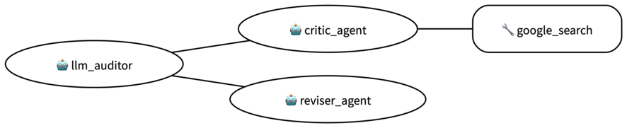

# LLM Auditor (Kotlin)

An automated fact-checking agent built with [Agent Development Kit
(ADK)](https://adk.dev) for Kotlin. It uses a sequential multi-agent pipeline to
verify LLM-generated answers and correct any inaccuracies.

## Overview

The LLM Auditor provides an automated layer of verification for LLM-generated
content. Given a question-answer pair, it first identifies and fact-checks every
claim in the answer using Google Search, then minimally revises the text to
correct any inaccuracies while preserving the original structure and style.

This sample demonstrates key ADK concepts including sequential agent
composition, after-model callbacks for response post-processing, and shared
model instances across sub-agents.

## Agent Details

| Feature | Description |
| --- | --- |
| **Interaction Type** | Conversational |
| **Complexity** | Intermediate |
| **Agent Type** | Multi-Agent (Sequential Pipeline) |
| **Components** | Tools: Google Search (built-in), Callbacks: AfterModelCallback |
| **Vertical** | Horizontal |

### Agent architecture

The LLM Auditor chains two sub-agents in a sequential pipeline:

1.  **Critic Agent**: Acts as an investigative journalist. It identifies every
    claim in the answer, verifies each claim using Google Search, and assigns a
    verdict (Accurate, Inaccurate, Disputed, Unsupported, or Not Applicable)
    with justification.

2.  **Reviser Agent**: Acts as a professional editor. It takes the original
    answer and the critic's findings, then minimally edits the text to correct
    inaccuracies while preserving the original structure and style. An
    after-model callback strips the edit marker from the output.



## Project Structure

```
llm-auditor/
    src/main/kotlin/com/google/adk/samples/agents/llmauditor/
        LlmAuditorAgent.kt    # Root SequentialAgent definition
        CriticAgent.kt        # Critic sub-agent (Google Search)
        CriticPrompt.kt       # Critic system prompt
        ReviserAgent.kt       # Reviser sub-agent (after-model callback)
        ReviserPrompt.kt      # Reviser system prompt
        Main.kt               # CLI entry point (ReplRunner)
        WebMain.kt            # Web UI entry point (AdkWebServer)
    build.gradle.kts
    settings.gradle.kts
    README.md
```

## Setup and Installation

### Prerequisites

- Java 17 or later
- Gradle 8.0 or later
- A [Gemini API key](https://aistudio.google.com/app/apikey)

### Installation

1.  Clone the repository and navigate to the agent directory:

    ```bash
    cd kotlin/agents/llm-auditor
    ```

2.  Set your Gemini API key as an environment variable:

    ```bash
    export GOOGLE_API_KEY="YOUR_API_KEY"
    ```

3.  Install dependencies and build:

    ```bash
    gradle build
    ```

## Running the Agent

### Command-line interface

Run the agent interactively in your terminal:

```bash
gradle run
```

### Web interface

Launch the ADK web UI to chat with the agent and inspect execution traces:

```bash
gradle run -PmainClass=com.google.adk.samples.agents.llmauditor.WebMainKt
```

Then open http://localhost:8080 in your browser.

## Example Interaction

Below is an example interaction with the LLM Auditor. Note that the exact output
of the agent may be different every time.

```
user: Double check this: Question: Why is the sky blue? Answer: Because the
water is blue.

[critic_agent]: Okay, I will double-check the statement.

**Step 1: Identify the CLAIMS**

The answer contains one claim:

* CLAIM 1: The sky is blue because the water is blue.

**Step 2: Verify each CLAIM**

* CLAIM 1: The sky is blue because the water is blue.
    * Verdict: Inaccurate
    * Justification: The sky appears blue due to Rayleigh scattering, where
      shorter blue wavelengths of sunlight are scattered more by gas molecules
      in Earth's atmosphere. The color of water is not the cause.

* Overall verdict: Inaccurate
* Overall justification: The answer incorrectly attributes the sky's blue
  color to the color of water.

[reviser_agent]: The sky appears blue because of a phenomenon called Rayleigh
scattering. When sunlight enters Earth's atmosphere, shorter blue wavelengths
of light are scattered more than other colors by gas molecules, making the sky
appear blue to observers on the ground.
```

## Customization

The LLM Auditor can be customized to better suit your requirements. For example:

1.  **Substitute the Retrieval Mechanism:** Replace the critic sub-agent's
    default `GoogleSearchTool` with an alternative retrieval tool tailored to
    your data sources.
2.  **Customize Agent Instructions:** Modify the prompts guiding the critic
    and reviser sub-agents in `CriticPrompt.kt` and `ReviserPrompt.kt`. This
    allows you to direct their focus (e.g., checking against specific
    compliance rules, ensuring a certain writing style) or refine the format
    of their feedback and revisions.
3.  **Implement Iterative Processing:** Configure the LLM Auditor to operate
    iteratively. Instead of a single pass, the response can be repeatedly
    evaluated and rewritten by the agents until predefined quality thresholds
    are achieved.

## Disclaimer

This agent sample is provided for illustrative purposes only and is not intended
for production use. It serves as a basic example of an agent and a foundational
starting point for individuals or teams to develop their own agents.

This sample has not been rigorously tested, may contain bugs or limitations, and
does not include features or optimizations typically required for a production
environment (e.g., robust error handling, security measures, scalability,
performance considerations, comprehensive logging, or advanced configuration
options).

Users are solely responsible for any further development, testing, security
hardening, and deployment of agents based on this sample. We recommend thorough
review, testing, and the implementation of appropriate safeguards before using
any derived agent in a live or critical system.
